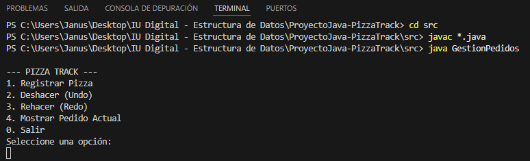
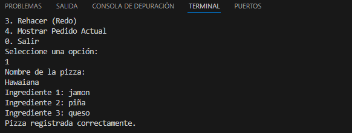
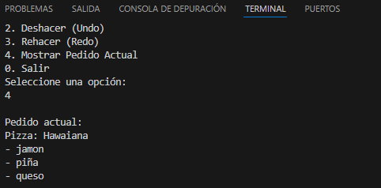

# 🍕 PizzaTrack – Sistema de Gestión de Pedidos con Pilas en Java

## 📌 Autor

Nombre: Yeremy Jesus Berdugo Valencia
Curso: Estructura de Datos
Proyecto: PizzaTrack
Repositorio: https://github.com/Vesumon/ProyectoJava-PizzaTrack
Video de sustentación: (Link del video)

---

# 🎯 Objetivo del Proyecto

Desarrollar una aplicación en Java que permita comprender e implementar la estructura de datos **Pila (Stack)** mediante la simulación de un sistema de gestión de pedidos para una pizzería.

El sistema implementa la funcionalidad **Undo/Redo** utilizando **dos pilas manuales construidas con listas ligadas**, permitiendo registrar pedidos, deshacerlos y rehacerlos.

---

# 🧠 Conceptos Aplicados

En este proyecto se aplican los siguientes conceptos de estructuras de datos:

* Implementación manual de **Pilas (Stack)**
* Uso de **Listas Ligadas**
* Manejo de **Nodos**
* Gestión de memoria mediante **referencias**
* Simulación de **Undo / Redo**
* Uso de **arreglos de tamaño fijo**

---

# 🏗️ Arquitectura del Sistema

El sistema funciona mediante **dos pilas**:

### Pila Principal (Undo)

Almacena los pedidos activos realizados por el usuario.

Operaciones:

* push() → Registrar nuevo pedido
* pop() → Deshacer pedido
* peek() → Ver pedido actual

### Pila Secundaria (Redo)

Guarda temporalmente los pedidos que fueron deshechos para permitir recuperarlos.

Operación:

* push() → Guardar pedido deshecho
* pop() → Recuperar pedido

---

# 📂 Estructura del Proyecto

```
ProyectoJava-PizzaTrack
│
├─ src
│   ├─ Pizza.java
│   ├─ Nodo.java
│   ├─ Pila.java
│   └─ GestionPedidos.java
│
├─ capturas
│   ├─ menu.png
│   ├─ registrar.png
│   ├─ pedido_actual.png
│   └─ undo_redo.png
│
├─ README.md
└─ .gitignore
```

---

# ⚙️ Cómo Ejecutar el Programa

1. Abrir el proyecto en **Visual Studio Code**.
2. Abrir la terminal dentro del proyecto.
3. Ir a la carpeta `src`.

```
cd src
```

4. Compilar los archivos Java.

```
javac *.java
```

5. Ejecutar el programa.

```
java GestionPedidos
```

---

# 🖥️ Menú del Sistema

El programa muestra el siguiente menú en consola:

```
1. Registrar Pizza
2. Deshacer (Undo)
3. Rehacer (Redo)
4. Mostrar Pedido Actual
0. Salir
```

---

# 📸 Evidencia de Ejecución

## Menú del programa



## Registro de pizza



## Pedido actual



## Funcionamiento Undo / Redo

(colocar captura)

```
capturas/undo_redo.png
```

---

# 🎥 Video de Sustentación

En el siguiente video se explica:

* Funcionamiento del programa
* Implementación de la pila
* Explicación de los métodos **push()** y **pop()**
* Demostración del ciclo **Registrar → Deshacer → Rehacer**

Link del video:

(Aquí colocas el enlace)

---

# 📚 Conclusión

Este proyecto permitió comprender el funcionamiento de la estructura de datos **Pila**, implementándola manualmente mediante **listas ligadas**.

La simulación del sistema de pedidos de una pizzería permitió aplicar el concepto de **Undo/Redo**, demostrando cómo dos pilas pueden trabajar juntas para gestionar estados dentro de una aplicación.
